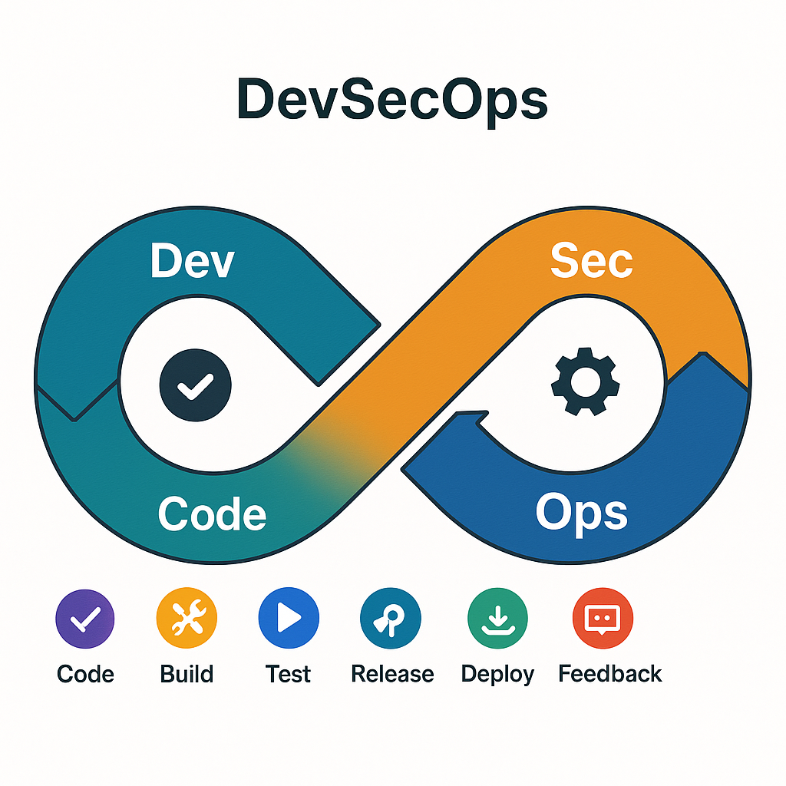

# Arquitetura da Solução

A aplicação **OWASP Juice Shop** é empacotada em um contêiner Docker, orquestrada em Kubernetes (*Kind* durante desenvolvimento). A infraestrutura é declarada via **Helm Chart** e **Terraform** (futuro ambiente cloud), permitindo:  
* **Reprodutibilidade** – qualquer membro do time pode levantar o ambiente com `make deploy-local`.  
* **Segurança por padrão** – imagens com base Alpine, execução como usuário não‑root.

## Componentes
| Camada | Tecnologia | Função |
|--------|------------|--------|
| **IaC** | Terraform + Helm | Provisiona cluster (K8s) e recursos (Ingress, Secrets) |
| **CI/CD** | GitHub Actions | Build, testes, scans, deploy & monitoramento |
| **SAST** | SonarQube/CodeQL | Analisa código Node JS (JS/TS) |
| **Dependency Scan** | npm audit + OWASP Dep-Check | Identifica libs vulneráveis |
| **Container Scan** | Trivy | Avalia CVEs em imagem Docker |
| **DAST** | OWASP ZAP | Teste dinâmico em ambiente staging |
| **Observabilidade** | Prometheus + Grafana | Métricas & alertas (pod memory, HTTP 5xx) |

A figura acima ilustra o **laço Dev‑Sec‑Ops** contínuo em que cada commit percorre build → segurança → release → monitoramento, retroalimentando melhorias.
