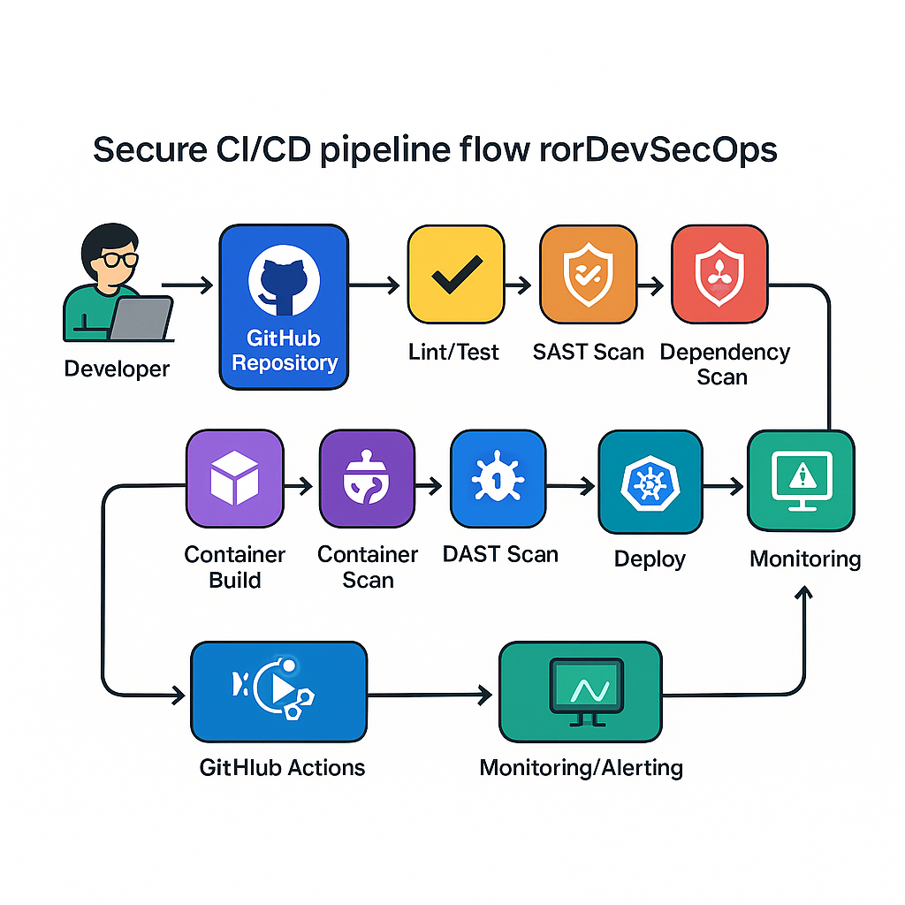

# Pipeline CI/CD Segura

A pipeline principal (`.github/workflows/build-secure.yml`) é acionada em **pull_request** e **push** para `main`:

| Ordem | Job | Ferramenta | Descrição |
|-------|-----|------------|-----------|
| 1 | **build-test** | Node/NPM | Instala dependências, executa testes unitários + cobertura |
| 2 | **lint** | ESLint/Prettier | Garante padrão de código |
| 3 | **sast** | SonarQube (ou CodeQL) | Scan estático – qualidade + vulnerabilidades |
| 4 | **deps-scan** | npm audit + OWASP Dep-Check | Verifica CVEs em libs NPM |
| 5 | **container-build** | Docker Buildx | Constrói imagem `juiceshop:pr-<sha>` |
| 6 | **trivy-scan** | Trivy | CVEs em SO + libs no contêiner |
| 7 | **dast** | OWASP ZAP Baseline | Spider + passive scan contra ambiente preview |
| 8 | **deploy-kind** | kubectl + Helm | Implanta no cluster Kind (namespaces isolados por PR) |
| 9 | **notify** | GitHub Checks | Publica resultados & artifacts (SARIF, HTML) |

## Integrações de Segurança
* **SARIF Upload** → GitHub Security Tab  
* **Alertas de Alta Severidade** falham o build (policy gate)  
* **Cache de Vulnerability DB** (Dep-Check, Trivy) acelera execuções subsequentes  
* **Cron semanal** executa ZAP *full-scan* & Dep-Check completo em branch `main`.
