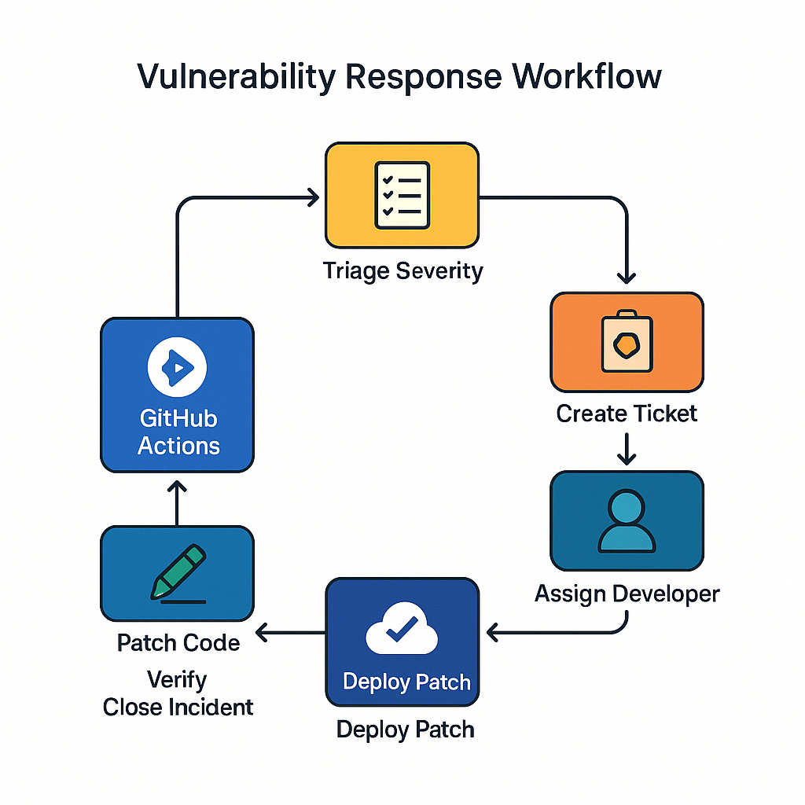

# Política de Segurança – DevSecOps

## 1. Propósito
Estabelecer diretrizes mínimas para integrar segurança durante todo o ciclo de vida de desenvolvimento, build, deploy e operação da plataforma **SecureTasks**.

## 2. Escopo
Aplica-se a todos os projetos de software hospedados sob a organização GitHub *SecureTasks* e infraestruturas suportadas (on‑prem & cloud).

## 3. Princípios
1. **Shift‑Left** – segurança é incorporada o mais cedo possível.  
2. **Automação** – verificações obrigatórias via pipelines; builds sem aprovação de segurança falharão.  
3. **Responsabilidade Compartilhada** – Dev, Sec, Ops dividem a responsabilidade por vulnerabilidades.

## 4. Requisitos
| Categoria | Diretriz | Responsável |
|-----------|---------|-------------|
| **Código** | SAST obrigatório em cada PR; cobertura ≥ 80 % de testes unitários | Dev + SecChamp |
| **Dependências** | Ferramentas de scan (npm audit/Dep‑Check) em cada build; updates em até 7 dias para severidade alta | Dev |
| **Contêiner** | Imagens base oficiais, execução como non‑root, scan Trivy sem falhas críticas | DevOps |
| **Deploy** | IaC versionada; revisão obrigatória em PR; secrets no GitHub Secrets ou Vault | DevOps |
| **Monitoramento** | Logs centralizados + alertas de anomalia (MTTD ≤ 4 h) | SecOps |

## 5. Gestão de Vulnerabilidades
1. **Triage** em ≤ 24 h para severidade Alta/Crítica.  
2. **SLA de Correção**: Crítica – 72 h; Alta – 7 dias; Média – 30 dias; Baixa – quando possível.  
3. **Fluxo** conforme diagrama .

## 6. Avaliação e Mitigação de Riscos
Adotar **OWASP Risk Rating Methodology** para avaliar impacto × probabilidade, priorizando mitigação.

## 7. Treinamento
Todos os devs devem concluir o curso OWASP Top 10 anualmente; novos membros em até 30 dias.

## 8. Conformidade
Revisões semestrais; violações reportadas ao CISO. Sanções aplicáveis às equipes em desacordo.
